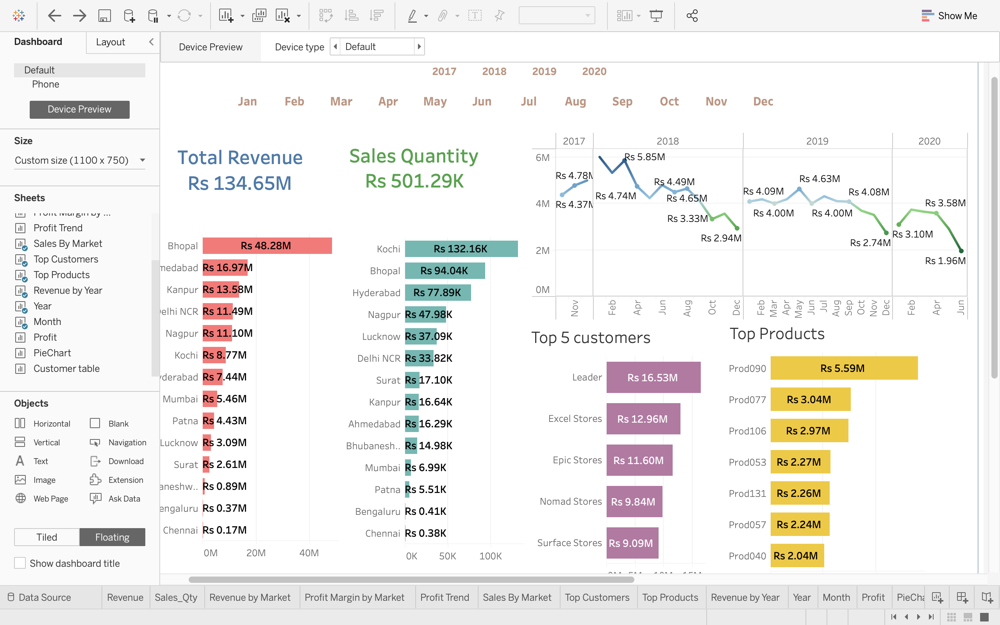
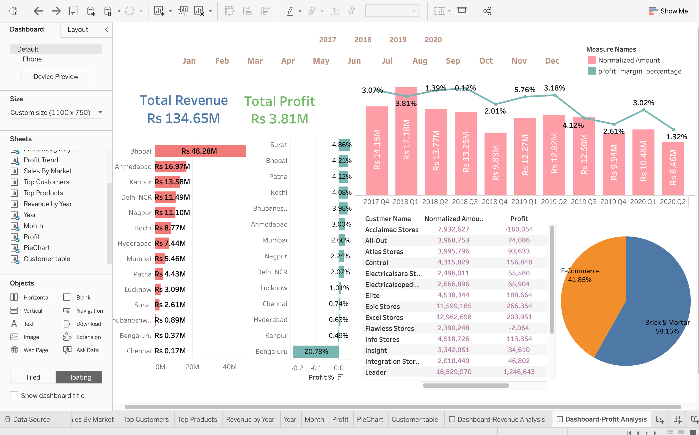

# Sales Insights Data Analysis Project using Tableau

https://user-images.githubusercontent.com/63813872/138419199-851bcbe5-47f6-481a-90f8-a61528147c72.mov

## Setup Process
Step1: Download db_dump.sql

Step2: Import it in MySql do ETL(extract,transform,load) if required

Step3: Connect Tableau with MySql database

Step4: Use the Tableau(.twb file) dashboard provided in the repo. It contains all the Worksheets and Dashboards

## Data Analysis Using SQL

Show all customer records
<code>SELECT * FROM customers;</code>

Show total number of customers
<code>SELECT count(*) FROM customers;</code>

Show transactions for Chennai market (market code for chennai is Mark001

<code>SELECT * FROM transactions where market_code='Mark001';</code>

Show distrinct product codes that were sold in chennai

<code>SELECT distinct product_code FROM transactions where market_code='Mark001';</code>

Show transactions where currency is US dollars
<code>SELECT * from transactions where currency="USD"
</code>

Show transactions in 2020 join by date table
<code>SELECT transactions.*, date.* FROM transactions INNER JOIN date ON transactions.order_date=date.date where date.year=2020;
</code>

Show total revenue in year 2020,
<code>SELECT SUM(transactions.sales_amount) FROM transactions INNER JOIN date ON transactions.order_date=date.date where date.year=2020 and transactions.currency="INR\r" or transactions.currency="USD\r";
</code>

Show total revenue in year 2020, January Month,

<code>SELECT SUM(transactions.sales_amount) FROM transactions INNER JOIN date ON transactions.order_date=date.date where date.year=2020 and and date.month_name="January" and (transactions.currency="INR\r" or transactions.currency="USD\r"); </code>

Show total revenue in year 2020 in Chennai

<code>SELECT SUM(transactions.sales_amount) FROM transactions INNER JOIN date ON transactions.order_date=date.date where date.year=2020 and transactions.market_code="Mark001";
</code>
